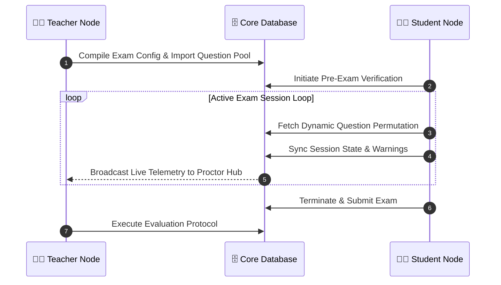

<div align="center">

<!-- Animated Header Banner -->


<!-- Logo -->


<br>

<!-- Animated Typing SVG -->
<a href="https://github.com/Param-vadher/ProctorIQ">
  
</a>

<br><br>

<!-- Repo Metrics Badges -->


<br><br>

<!-- Quick Nav Buttons -->
<a href="#-the-tri-node-architecture"></a>&nbsp;
<a href="#-system-gallery"></a>&nbsp;
<a href="#%EF%B8%8F-core-subsystems"></a>&nbsp;
<a href="#-initialization-sequence"></a>

</div>

---

## 🌌 What is ProctorIQ?

**ProctorIQ** is a next-generation, full-stack online examination platform built on a **Zero-Trust security architecture**. It moves beyond basic quiz forms to create a cryptographically hardened examination environment with:

- 🔐 **JWT-based role routing** — Teachers, Students, and Admins each enter a completely separate, protected portal.
- 🧠 **Dynamic exam generation** — Every student gets a unique question permutation based on `Easy / Medium / Hard` config.
- 📡 **Real-time proctoring** — Teachers watch live exam telemetry as it streams from each active session.
- 🛡️ **Active Session Warden** — Every click, tab-switch, and answer is tracked and enforced server-side.

<br>

## 🔥 Tech Stack Engine

<div align="center">
  <a href="https://skillicons.dev">
    
  </a>
</div>

---

## 🏗️ The Tri-Node Architecture

ProctorIQ segregates users into three distinct, hyper-secure portals managed by strict React Protected Routes and Backend Middleware.

<table width="100%" style="border-collapse: separate; border-spacing: 12px;">
  <tr>
    <td width="33%" align="center" valign="top" style="border: 2px solid #2563eb; border-radius: 12px; padding: 18px;">
      <h3>👨‍🏫 Teacher Node</h3>
      
      <br><br>
      <ul align="left">
        <li><b>📥 Bulk Question Importer</b></li>
        <li><b>⚙️ Dynamic Exam Configs</b></li>
        <li><b>📡 Live Proctor Hub</b></li>
        <li><b>✅ Evaluation Center</b></li>
      </ul>
    </td>
    <td width="33%" align="center" valign="top" style="border: 2px solid #2563eb; border-radius: 12px; padding: 18px;">
      <h3>👨‍🎓 Student Node</h3>
      
      <br><br>
      <ul align="left">
        <li><b>🔍 Pre-Exam Verification</b></li>
        <li><b>🎯 Live Exam Wrapper</b></li>
        <li><b>📋 Teacher Directory</b></li>
        <li><b>🚪 Exam Lobby</b></li>
      </ul>
    </td>
    <td width="33%" align="center" valign="top" style="border: 2px solid #2563eb; border-radius: 12px; padding: 18px;">
      <h3>👑 Command Node</h3>
      
      <br><br>
      <ul align="left">
        <li><b>🏆 Global Leaderboard</b></li>
        <li><b>👥 User Accounts Manager</b></li>
        <li><b>🔧 System Settings</b></li>
        <li><b>📢 Announcements Manager</b></li>
      </ul>
    </td>
  </tr>
</table>

---

## 📸 System Gallery

<div align="center">

### 🏠 Public Portal
&nbsp;


*Clean, intuitive interface designed for maximum discoverability.*

<br>

<kbd></kbd>

</div>

<br>

<div align="center">

### 👨‍🎓 Student Examination Node
&nbsp;


*Real-time exam wrapper with strict active session monitoring.*

<br>

<kbd></kbd>&nbsp;
<kbd></kbd>

</div>

<br>

<div align="center">

### 👨‍🏫 Teacher Command Center
&nbsp;


*Centralized live proctoring hub and dynamic question management.*

<br>

<kbd></kbd>&nbsp;
<kbd></kbd>&nbsp;
<kbd></kbd>

</div>

<br>

<div align="center">

### 👑 Admin Dashboard
&nbsp;


*Global metrics, user provisioning, and absolute system oversight.*

<br>

<kbd></kbd>&nbsp;
<kbd></kbd>

</div>

---

## ⚙️ Core Subsystems

| # | Subsystem | Description |
|---|-----------|-------------|
| 🔍 | **SEO & Discoverability** | `react-helmet-async` for dynamic meta tags, `robots.txt`, and `sitemap.xml` |
| 📥 | **Bulk JSON Import Engine** | Upload structured JSON to instantly provision subjects and questions |
| 🛡️ | **Zero-Trust Session Warden** | `ActiveExamSessions` tracks every click, warning, and question state |
| 🎲 | **Dynamic Exam Generator** | Unique `Easy/Medium/Hard` question permutations per candidate |
| 📡 | **Live Proctor Hub** | High-frequency telemetry stream to teacher dashboard |
| 🔐 | **Cryptographic Auth** | `bcrypt` + HTTP-only cookies + role-encoded JWT matrices |

---

## 🧠 Data Flow Diagram



---

## 🚀 Initialization Sequence

Deploy ProctorIQ locally in under 3 minutes.

### 1️⃣ Prerequisites

| Tool | Requirement |
|------|-------------|
|  | v18 or higher |
|  | Any version |
|  | Latest stable |

### 2️⃣ Clone & Install

```bash
# Clone the repository
git clone https://github.com/Param-vadher/ProctorIQ.git

# Install backend dependencies
cd ProctorIQ/backend && npm install

# Install frontend dependencies
cd ../frontend && npm install
```

### 3️⃣ Environment Matrix

Create a `.env` file in the `backend/` directory — ProctorIQ **auto-seeds the Admin account** on first boot.

<details>
<summary><b>🔐 View .env Configuration</b></summary>
<br/>

```env
# -----------------------------
# 📦 Database Connection
# -----------------------------
MONGO_URI=mongodb://localhost:27017/ProctorIQ_db

# -----------------------------
# 🔐 Security & Network
# -----------------------------
JWT_SECRET=your_super_secret_jwt_key
PORT=5000
FRONTEND_URL=http://localhost:5173

# -----------------------------
# 👑 Initial Admin Seeder
# -----------------------------
ADMIN_EMAIL=admin@proctoriq.com
ADMIN_PASSWORD=admin@951052
```

</details>

### 4️⃣ Database Setup

MongoDB is schema-less — **no migrations needed**. The database auto-builds on first boot.

> **💡 Tip:** Run `node reset_db.js` inside `backend/` to wipe and reseed during development.

**Bulk Question Importing:** Log in as a Teacher and use the **Bulk Question Importer** to upload JSON datasets (e.g., `os_questions.json`).

### 5️⃣ Launch 🚀

```bash
cd frontend
npm run dev
```

> 🌐 **Client:** `http://localhost:5173` &nbsp;|&nbsp; 🔌 **Server:** `http://localhost:5000`

---

## 📬 Connect with the Developer

<div align="center">

**Param Vadher** — Architect & Full-Stack Developer of ProctorIQ

<br>

<a href="https://github.com/Param-vadher"></a>&nbsp;
<a href="https://www.linkedin.com/in/param-vadher-b1a9b7333"></a>&nbsp;
<a href="mailto:paramvadher04@gmail.com"></a>

<br><br>


</div>
