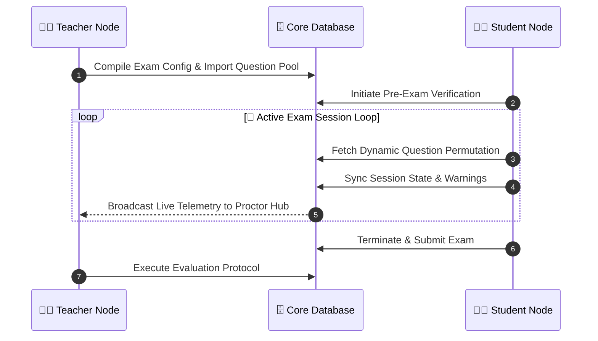

<div align="center">

<!-- ═══════════════════════════════════════════════════ -->
<!--                   HERO HEADER                      -->
<!-- ═══════════════════════════════════════════════════ -->


<br>

<!-- LOGO -->


<br>

<!-- Animated Typing -->
<a href="https://github.com/Param-vadher/ProctorIQ">
  
</a>

<br><br>


<!-- Tech Stack Pill Badges -->


<br><br>

<!-- Quick Navigation -->
<a href="#-what-is-proctoriq"></a>&nbsp;
<a href="#-the-tri-node-architecture"></a>&nbsp;
<a href="#-system-gallery"></a>&nbsp;
<a href="#️-core-subsystems"></a>&nbsp;
<a href="#-initialization-sequence"></a>

</div>

---

## 📖 What is ProctorIQ?

> **ProctorIQ** is a next-generation, full-stack online examination platform engineered on a **Zero-Trust security architecture**. Built for institutions that demand airtight academic integrity.

| 🔐 JWT Role Routing | 🧠 Dynamic Exam Engine | 📡 Live Proctoring | 🛡️ Session Warden |
|---|---|---|---|
| Separate hardened portals per role | Unique question permutations per student | Real-time telemetry stream to teachers | Tracks every click, tab, and answer |

<br>

## 🔥 Tech Stack Engine

<div align="center">
  <a href="https://skillicons.dev">
    
  </a>
</div>

---

## 🏗️ The Tri-Node Architecture

> ProctorIQ separates every user into one of three cryptographically isolated portals, each governed by strict **React Protected Routes** + **Backend JWT Middleware**.

<table width="100%">
  <tr>
    <td width="33%" align="center" valign="top" style="border: 2px solid #2563eb; border-radius: 14px; padding: 20px; background: linear-gradient(135deg,#0f172a,#1e3a5f);">
      
      <br><br>
      <ul align="left">
        <li>📥 <b>Bulk Question Importer</b></li>
        <li>⚙️ <b>Dynamic Exam Configurator</b></li>
        <li>📡 <b>Live Proctor Hub</b></li>
        <li>✅ <b>Evaluation Center</b></li>
        <li>📊 <b>Result Analytics</b></li>
      </ul>
    </td>
    <td width="33%" align="center" valign="top" style="border: 2px solid #1d4ed8; border-radius: 14px; padding: 20px; background: linear-gradient(135deg,#0f172a,#1e3a5f);">
      
      <br><br>
      <ul align="left">
        <li>🔍 <b>Pre-Exam Verification</b></li>
        <li>🎯 <b>Live Exam Wrapper</b></li>
        <li>🛡️ <b>Session Warden</b></li>
        <li>📋 <b>Teacher Directory</b></li>
        <li>🚪 <b>Exam Lobby</b></li>
      </ul>
    </td>
    <td width="33%" align="center" valign="top" style="border: 2px solid #60a5fa; border-radius: 14px; padding: 20px; background: linear-gradient(135deg,#0f172a,#1e3a5f);">
      
      <br><br>
      <ul align="left">
        <li>🏆 <b>Global Leaderboard</b></li>
        <li>👥 <b>User Accounts Manager</b></li>
        <li>🔧 <b>System Settings</b></li>
        <li>📢 <b>Announcements Manager</b></li>
        <li>📈 <b>Platform Statistics</b></li>
      </ul>
    </td>
  </tr>
</table>

---

<div align="center">

<h2>📸 System Gallery</h2>


</div>

<br>

<!-- ─── 1. HOME ─────────────────────────────── -->
<table width="100%">
  <tr>
    <td align="center" style="padding: 20px; border: 2px solid #2563eb; border-radius: 16px;">
      <h3>🏠 Public Portal</h3>
      &nbsp;
      &nbsp;
      
      <br><br>
      
      <br><br>
      <i>Clean landing page built for first impressions and full SEO discoverability.</i>
    </td>
  </tr>
</table>

<br>

<!-- ─── 2 & 3. STUDENT ────────────────────── -->
<table width="100%">
  <tr>
    <td colspan="2" align="center" style="padding: 14px 20px 8px; border: 2px solid #1d4ed8; border-radius: 16px 16px 0 0;">
      <h3>👨‍🎓 Student Examination Node</h3>
      &nbsp;
      &nbsp;
      
    </td>
  </tr>
  <tr>
    <td width="50%" align="center" style="padding: 12px; border: 2px solid #1d4ed8; border-top: none; border-right: 1px solid #1d4ed8; border-radius: 0 0 0 16px;">
      
      <br><sub>📋 Exam Lobby & Pre-Check</sub>
    </td>
    <td width="50%" align="center" style="padding: 12px; border: 2px solid #1d4ed8; border-top: none; border-left: 1px solid #1d4ed8; border-radius: 0 0 16px 0;">
      
      <br><sub>🎯 Live Exam Wrapper in Session</sub>
    </td>
  </tr>
</table>

<br>

<!-- ─── 4, 5, 6. TEACHER ──────────────────── -->
<table width="100%">
  <tr>
    <td colspan="3" align="center" style="padding: 14px 20px 8px; border: 2px solid #2563eb; border-radius: 16px 16px 0 0;">
      <h3>👨‍🏫 Teacher Command Center</h3>
      &nbsp;
      &nbsp;
      
    </td>
  </tr>
  <tr>
    <td width="33%" align="center" style="padding: 10px; border: 2px solid #2563eb; border-top: none; border-right: 1px solid #2563eb; border-radius: 0 0 0 16px;">
      
      <br><sub>📥 Bulk Question Importer</sub>
    </td>
    <td width="33%" align="center" style="padding: 10px; border-top: none; border-bottom: 2px solid #2563eb;">
      
      <br><sub>📡 Live Proctor Hub</sub>
    </td>
    <td width="33%" align="center" style="padding: 10px; border: 2px solid #2563eb; border-top: none; border-left: 1px solid #2563eb; border-radius: 0 0 16px 0;">
      
      <br><sub>✅ Evaluation Center</sub>
    </td>
  </tr>
</table>

<br>

<!-- ─── 7 & 8. ADMIN ──────────────────────── -->
<table width="100%">
  <tr>
    <td colspan="2" align="center" style="padding: 14px 20px 8px; border: 2px solid #60a5fa; border-radius: 16px 16px 0 0;">
      <h3>👑 Admin Command Dashboard</h3>
      &nbsp;
      &nbsp;
      
    </td>
  </tr>
  <tr>
    <td width="50%" align="center" style="padding: 12px; border: 2px solid #60a5fa; border-top: none; border-right: 1px solid #60a5fa; border-radius: 0 0 0 16px;">
      
      <br><sub>👥 User Accounts Manager</sub>
    </td>
    <td width="50%" align="center" style="padding: 12px; border: 2px solid #60a5fa; border-top: none; border-left: 1px solid #60a5fa; border-radius: 0 0 16px 0;">
      
      <br><sub>📈 Platform Statistics & Overview</sub>
    </td>
  </tr>
</table>

---

## ⚙️ Core Subsystems

<table width="100%">
  <tr>
    <td width="50%" style="border: 1px solid #2563eb; border-radius: 10px; padding: 16px;">
      <h4>🔍 SEO & Discoverability</h4>
      <code>react-helmet-async</code> for dynamic meta tags, Open Graph, <code>robots.txt</code> + <code>sitemap.xml</code>
    </td>
    <td width="50%" style="border: 1px solid #2563eb; border-radius: 10px; padding: 16px;">
      <h4>📥 Bulk JSON Import Engine</h4>
      Upload structured JSON to instantly provision subjects and 100+ questions in one click
    </td>
  </tr>
  <tr>
    <td width="50%" style="border: 1px solid #2563eb; border-radius: 10px; padding: 16px;">
      <h4>🛡️ Zero-Trust Session Warden</h4>
      <code>ActiveExamSessions</code> tracks every navigation, warning flag, and answer server-side
    </td>
    <td width="50%" style="border: 1px solid #2563eb; border-radius: 10px; padding: 16px;">
      <h4>🎲 Dynamic Exam Generator</h4>
      Unique <code>Easy / Medium / Hard</code> question permutations compiled fresh per candidate
    </td>
  </tr>
  <tr>
    <td width="50%" style="border: 1px solid #2563eb; border-radius: 10px; padding: 16px;">
      <h4>📡 Live Proctor Hub</h4>
      High-frequency telemetry stream from student sessions to the teacher dashboard in real-time
    </td>
    <td width="50%" style="border: 1px solid #2563eb; border-radius: 10px; padding: 16px;">
      <h4>🔐 Cryptographic Auth Layer</h4>
      <code>bcrypt</code> password hashing + HTTP-only cookie sessions + role-encoded JWT matrices
    </td>
  </tr>
</table>

---

## 🧠 Data Flow Diagram



---

## 🚀 Initialization Sequence

> Deploy ProctorIQ locally in under **3 minutes**.

### 1️⃣ Prerequisites

| Tool | Min Version | Badge |
|------|------------|-------|
| Node.js | v18+ |  |
| MongoDB | Any |  |
| Git | Latest |  |

### 2️⃣ Clone & Install

```bash
# Clone the repository
git clone https://github.com/Param-vadher/ProctorIQ.git

# Install backend
cd ProctorIQ/backend && npm install

# Install frontend
cd ../frontend && npm install
```

### 3️⃣ Environment Matrix

Create `.env` inside `backend/` — the server **auto-seeds the Admin** on first boot.

<details>
<summary><b>🔐 Click to expand .env config</b></summary>
<br/>

```env
# ── Database ──────────────────────
MONGO_URI=mongodb://localhost:27017/ProctorIQ_db

# ── Security & Network ────────────
JWT_SECRET=your_super_secret_jwt_key
PORT=5000
FRONTEND_URL=http://localhost:5173

# ── Admin Seeder ──────────────────
ADMIN_EMAIL=admin@proctoriq.com
ADMIN_PASSWORD=admin@951052
```

</details>

### 4️⃣ Database

MongoDB is **schema-less** — no migrations needed. Auto-builds on first boot.

> 💡 Run `node reset_db.js` inside `backend/` to wipe & reseed during development.  
> 📥 Use the **Bulk Question Importer** (Teacher login) to load `os_questions.json` etc.

### 5️⃣ Launch 🚀

```bash
cd frontend
npm run dev
```

<div align="center">

| 🌐 Client | 🔌 Server |
|-----------|----------|
| `http://localhost:5173` | `http://localhost:5000` |

</div>

---

## 📬 Connect with the Developer

<div align="center">

<br>


**Architect & Full-Stack Developer of ProctorIQ**

<br>

<a href="https://github.com/Param-vadher">
  
</a>&nbsp;&nbsp;
<a href="https://www.linkedin.com/in/param-vadher-b1a9b7333">
  
</a>&nbsp;&nbsp;
<a href="mailto:paramvadher04@gmail.com">
  
</a>


</div>
