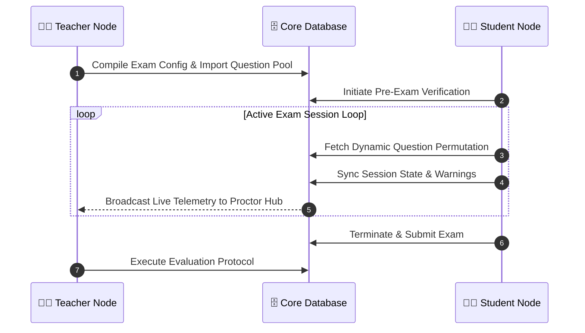

<div align="center">
  <!-- Navy to Royal Blue Dynamic Header -->
  

  <!-- Dynamic Logo Placement with Blue Glow -->
  <a href="https://github.com/Param-vadher/ProctorIQ">
    
  </a>

  <!-- Royal Blue Animated Typing Subtitle -->
  <br>
  <a href="https://github.com/Param-vadher/ProctorIQ">
    
  </a>
  <br><br>

  <!-- Custom Themed Badges -->
  <a href="https://github.com/Param-vadher/ProctorIQ"></a>
  <br><br>

  <a href="#"></a>
  <a href="#"></a>
  <a href="#"></a>
  <a href="#"></a>
</div>

<br>
<div align="center">
  
</div>
<br>

## 🌌 The ProctorIQ Matrix

**ProctorIQ** represents a paradigm shift in online examination architecture. Moving beyond standard form-based tests, ProctorIQ establishes a cryptographically secure environment. By utilizing deep state tracking, dynamic question algorithms, and strict **JSON Web Token (JWT)** authentication routing, we guarantee complete academic integrity.

<details>
  <summary><b>📺 View System Interface (Click to Expand)</b></summary>
  <div align="center">
    
  </div>
</details>

<br>
<div align="center">
  
</div>
<br>

## 🏗️ The Tri-Node Architecture

ProctorIQ segregates users into three distinct, hyper-secure portals managed by strict React Protected Routes and Backend Middleware.

<table>
  <tr>
    <td width="33%" align="center" style="background: rgba(37, 99, 235, 0.05); border-radius: 10px;">
      <h3>👨‍🏫 Teacher Node</h3>
      <hr style="border-color: #2563eb; opacity: 0.3;"/>
      <ul align="left">
        <li><b>Bulk Question Importer</b></li>
        <li><b>Dynamic Exam Configs</b></li>
        <li><b>Live Proctor Hub</b></li>
        <li><b>Evaluation Center</b></li>
      </ul>
    </td>
    <td width="33%" align="center" style="background: rgba(37, 99, 235, 0.05); border-radius: 10px;">
      <h3>👨‍🎓 Student Node</h3>
      <hr style="border-color: #2563eb; opacity: 0.3;"/>
      <ul align="left">
        <li><b>Pre-Exam Verification</b></li>
        <li><b>Live Exam Wrapper</b></li>
        <li><b>Teacher Directory</b></li>
        <li><b>Exam Lobby</b></li>
      </ul>
    </td>
    <td width="33%" align="center" style="background: rgba(37, 99, 235, 0.05); border-radius: 10px;">
      <h3>👑 Command Node</h3>
      <hr style="border-color: #2563eb; opacity: 0.3;"/>
      <ul align="left">
        <li><b>Global Leaderboard</b></li>
        <li><b>User Accounts Manager</b></li>
        <li><b>System Settings</b></li>
        <li><b>Announcements Manager</b></li>
      </ul>
    </td>
  </tr>
</table>

<br>
<div align="center">
  
</div>
<br>

## ⚙️ Core Subsystems

> 🛡️ **Zero-Trust Tracking**  
> `ActiveExamSessions` continuously map student paths, flag visited questions, calculate session warnings, and enforce strict test boundaries.

> 🎲 **Dynamic Exam Generator**  
> Tests are instantiated dynamically utilizing a `dynamicConfig` schema that compiles exact permutations of Easy, Medium, and Hard questions uniquely for each candidate.

> 📡 **Live Proctor Hub**  
> Teachers monitor a high-frequency stream of ongoing exams, gaining instantaneous telemetry into student progress and flagged anomalies.

> 🔐 **Cryptographic Auth**  
> Complete integration of bcrypt password hashing, HTTP-only cookie protocols, and role-encoded JWT matrices.

<br>
<div align="center">
  
</div>
<br>

## 🧠 Data Flow Diagram



<br>
<div align="center">
  
</div>
<br>

## 🚀 Initialization Sequence

Deploy the ProctorIQ ecosystem locally in under 3 minutes.

### 1️⃣ Dependencies
- <kbd>Node.js v18+</kbd>
- <kbd>MongoDB Engine</kbd> (Local or Atlas)
- <kbd>Git</kbd>

### 2️⃣ Clone & Install
```bash
# Clone the repository
git clone https://github.com/Param-vadher/ProctorIQ.git

# Install dependencies for both the backend and frontend
cd ProctorIQ/backend && npm install
cd ../frontend && npm install
```

### 3️⃣ Environment Matrix
Create a `.env` file in the `backend/` directory. **ProctorIQ will automatically seed the initial Admin account** on its first boot based on these credentials.

<details>
<summary><b>View .env Configuration Matrix</b></summary>
<br/>

```env
# -----------------------------
# 📦 Database Connection
# -----------------------------
MONGO_URI=mongodb://localhost:27017/ProctorIQ_db

# -----------------------------
# 🔐 Security & Network
# -----------------------------
JWT_SECRET=super_secret_jwt_string
PORT=5000
FRONTEND_URL=http://localhost:5173

# -----------------------------
# 👑 Initial Admin Seeder
# -----------------------------
ADMIN_EMAIL=admin@proctoriq.com
ADMIN_PASSWORD=admin@951052
```
</details>

### 4️⃣ 🗄️ Database Setup & Seeding

Since ProctorIQ utilizes a dynamic NoSQL database (MongoDB), no complex SQL schema queries are required. The database builds itself securely.

**A. Auto-Seeding the Admin**  
Ensure MongoDB is running locally on port `27017`. When you boot the server for the first time, it connects to `mongodb://localhost:27017/ProctorIQ_db` and automatically creates your Admin account using the credentials defined in your `.env` file.

**B. Database Maintenance Scripts**  
If you need to purge the database or force-update the admin account during development, utilize the included backend utility scripts:
```bash
cd backend
node reset_db.js       # Drops the entire ProctorIQ_db database safely
node update_admin.js   # Force updates the admin password
```

**C. Bulk Question Importing**  
Once logged in via the **Teacher Node**, navigate to the **Bulk Question Importer**. You can immediately populate exams using the pre-configured JSON datasets provided in the root directory:
- 📁 `nodejs_questions.json`
- 📁 `os_questions.json`
- 📁 `sample_questions.json`

### 5️⃣ Ignite 🚀
Start both the React Client and Express Server concurrently from the `/frontend` directory:

```bash
cd frontend
npm run dev
```

> **Client Node:** `http://localhost:5173` | **Server Node:** `http://localhost:5000`

<br>
<div align="center">
  
</div>
<br>

## 📬 Connect with the Developer

**Param Vadher**  
Architect & Full-Stack Developer of ProctorIQ.

<a href="https://github.com/Param-vadher"></a>
<a href="https://www.linkedin.com/in/param-vadher-b1a9b7333"></a>
<a href="mailto:paramvadher04@gmail.com"></a>

<div align="center">
  
</div>
